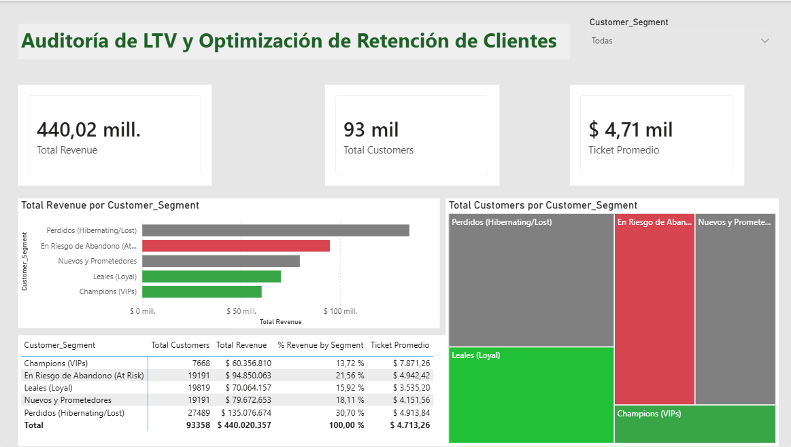

# 📊 Auditoría de LTV y Optimización de Retención de Clientes en Retail

<div align="center">


</div>

---

##  Tabla de Contenidos

1. [Resumen Ejecutivo](#1-resumen-ejecutivo)
2. [Contexto del Negocio y Problema](#2-contexto-del-negocio-y-problema)
3. [Arquitectura del Proyecto](#3-arquitectura-del-proyecto)
4. [Stack Tecnológico](#4-stack-tecnológico)
5. [Pipeline ETL — Paso a Paso](#5-pipeline-etl--paso-a-paso)
6. [Lógica SQL Avanzada](#6-lógica-sql-avanzada)
7. [Segmentación RFM — El Motor Analítico](#7-segmentación-rfm--el-motor-analítico)
8. [Dashboard Ejecutivo](#8-dashboard-ejecutivo)
9. [Hallazgos y Recomendaciones Estratégicas](#9-hallazgos-y-recomendaciones-estratégicas)
10. [Cómo Reproducir este Proyecto](#10-cómo-reproducir-este-proyecto)
11. [Estructura del Repositorio](#11-estructura-del-repositorio)
12. [Autor](#12-autor)

---

## 1. Resumen Ejecutivo

> **"El 79% del presupuesto de marketing de e-commerce se desperdicia en clientes que nunca volverán a comprar."**

Este proyecto construye un **pipeline analítico end-to-end** sobre ~100,000 registros transaccionales reales del marketplace brasileño Olist, con el objetivo de identificar con precisión quirúrgica qué clientes merecen inversión de retención y cuáles no.

Mediante un modelo de **segmentación RFM (Recencia, Frecuencia, Valor Monetario)** construido con SQL avanzado y visualizado en un dashboard ejecutivo de Power BI, se logró:

| Resultado | Cifra |
|---|---|
|  Capital en riesgo de abandono identificado | **$94.8 M** |
|  Ingresos de clientes VIP mapeados | **$60.3 M** |
|  Base de clientes con inversión ineficiente detectada | **27,489 usuarios** |
|  Registros transaccionales procesados | **~100,000** |

---

## 2. Contexto del Negocio y Problema

###  El Problema
La empresa operaba con una estrategia de marketing **"spray-and-pray"**: envíos masivos de correos y descuentos genéricos a toda la base de clientes sin distinción. Esta práctica genera dos fallas críticas:

1. **Erosión de margen con clientes VIP:** Los clientes más valiosos reciben descuentos que no necesitan para comprar, reduciendo el margen neto sin ningún beneficio en retención.
2. **Desperdicio presupuestario en clientes perdidos:** Se gasta dinero en reactivar clientes que estadísticamente nunca volverán a comprar.

###  El Objetivo Analítico
Implementar un modelo de segmentación **RFM** para clasificar a cada cliente según su comportamiento real y dirigir tácticamente cada acción de marketing, eliminando el desperdicio y maximizando el ROI de cada campaña.

###  Las Preguntas de Negocio que Resuelve este Proyecto

- ¿Qué clientes generan el 80% de los ingresos?
- ¿Cuántos clientes están a punto de abandonar la plataforma y cuánto dinero representan?
- ¿En qué segmentos **no** debemos gastar presupuesto de reactivación?
- ¿Cuál es el ticket promedio por tipo de cliente?

---

## 3. Arquitectura del Proyecto

```
RAW DATA (Olist CSV)
        │
        ▼
┌───────────────────┐
│  DuckDB + Python  │  ← Ingestión en memoria (sin servidor)
│  (Pandas ETL)     │
└────────┬──────────┘
         │
         ▼
┌───────────────────┐
│   SQL Engine      │  ← CTEs modulares + Window Functions (NTILE)
│   (CTEs + RFM)    │
└────────┬──────────┘
         │
         ▼
┌───────────────────┐
│ rfm_segments_     │  ← Archivo procesado (data/processed/)
│ final.csv         │
└────────┬──────────┘
         │
         ▼
┌───────────────────┐
│   Power BI        │  ← Modelo DAX + Dashboard Ejecutivo
│   Dashboard       │
└───────────────────┘
```

---

## 4. Stack Tecnológico

| Capa | Tecnología | Justificación |
|---|---|---|
| **Lenguaje** | Python 3.11 | Ecosistema de datos más robusto del mercado |
| **Motor SQL** | DuckDB 1.5.2 | Consultas SQL vectorizadas sobre CSV sin servidor de BD |
| **Manipulación** | Pandas 3.0 | Transformaciones y exportación de datos |
| **Entorno** | Virtual Env (.venv) | Reproducibilidad y aislamiento de dependencias |
| **BI & Visualización** | Power BI | Modelo DAX optimizado con variables (VAR/RETURN) |
| **Control de Versiones** | Git + GitHub | Historial de cambios y portafolio público |
| **IDE** | Cursor (VS Code fork) | Refactorización asistida por IA y Jupyter integrado |

---

## 5. Pipeline ETL — Paso a Paso

### Paso 1 — Ingestión de datos crudos

```python
import duckdb
import pandas as pd

# Conexión en memoria: no requiere instalar servidor de base de datos
con = duckdb.connect(database=':memory:')

# Los CSV se registran como vistas SQL virtuales (no se cargan completos a RAM)
con.execute("CREATE VIEW customers   AS SELECT * FROM read_csv_auto('../data/raw/olist_customers_dataset.csv')")
con.execute("CREATE VIEW orders      AS SELECT * FROM read_csv_auto('../data/raw/olist_orders_dataset.csv')")
con.execute("CREATE VIEW order_items AS SELECT * FROM read_csv_auto('../data/raw/olist_order_items_dataset.csv')")
```

### Paso 2 — Ejecución del motor SQL y exportación

```python
# El script SQL se carga desde /scripts/ para mantener separación de responsabilidades
with open('../scripts/01_rfm_segmentation.sql', 'r') as file:
    rfm_sql_query = file.read()

# Resultado como DataFrame de Pandas
df_rfm = con.execute(rfm_sql_query).df()

# Exportación a /processed/ — datos inmutables en /raw/, procesados en /processed/
df_rfm.to_csv('../data/processed/rfm_segments.csv', index=False)
```

### Paso 3 — Enriquecimiento con etiquetas de negocio

```python
def assign_segment(rfm_cell):
    """
    Traduce la celda matemática RFM a un segmento de negocio accionable.
    Parámetro: rfm_cell (str) — Concatenación de r_score, f_score, m_score (ej: '341')
    """
    r, f, m = int(rfm_cell[0]), int(rfm_cell[1]), int(rfm_cell[2])

    if r == 4 and f >= 3 and m >= 3:
        return 'Champions (VIPs)'
    elif r >= 3 and f >= 3:
        return 'Leales (Loyal)'
    elif r >= 3 and f <= 2:
        return 'Nuevos y Prometedores'
    elif r <= 2 and f >= 3:
        return 'En Riesgo de Abandono (At Risk)'
    elif r <= 2 and f <= 2:
        return 'Perdidos (Hibernating/Lost)'
    else:
        return 'Atención Requerida'

df['Customer_Segment'] = df['rfm_cell'].apply(assign_segment)
df.to_csv('../data/processed/rfm_segments_final.csv', index=False)
```

---

## 6. Lógica SQL Avanzada

El núcleo del análisis se ejecuta con **CTEs (Common Table Expressions)** anidadas que desglosan la lógica en pasos auditables. Se evitaron deliberadamente las subconsultas anidadas para maximizar la legibilidad y el rendimiento.

```sql
-- ============================================================
-- ARCHIVO: scripts/01_rfm_segmentation.sql
-- AUTOR: Bryan Morales | Data Analyst
-- DESCRIPCIÓN: Pipeline RFM con CTEs y Window Functions
-- ============================================================

-- PASO 1: Tabla de hechos transaccionales consolidada
WITH base_transactions AS (
    SELECT
        c.customer_unique_id,
        MAX(o.order_purchase_timestamp)  AS last_purchase_date,
        COUNT(DISTINCT o.order_id)       AS total_orders,
        SUM(oi.price)                    AS total_spent
    FROM customers c
    INNER JOIN orders      o  ON c.customer_id = o.customer_id
    INNER JOIN order_items oi ON o.order_id    = oi.order_id
    WHERE o.order_status = 'delivered'   -- Solo pedidos completados
    GROUP BY c.customer_unique_id
),

-- PASO 2: Cálculo de métricas absolutas RFM
rfm_metrics AS (
    SELECT
        customer_unique_id,
        -- Recencia: días desde la última compra vs. la fecha más reciente en la BD
        EXTRACT(DAY FROM (SELECT MAX(last_purchase_date) FROM base_transactions) - last_purchase_date) AS recency_days,
        total_orders AS frequency,
        total_spent  AS monetary
    FROM base_transactions
),

-- PASO 3: Asignación de cuartiles con Window Functions (el "motor" del modelo)
rfm_scoring AS (
    SELECT
        customer_unique_id,
        recency_days,
        frequency,
        monetary,
        -- NTILE(4): divide la población en 4 cuartiles (1=peor, 4=mejor)
        -- Recencia INVERSA: menos días = más reciente = mejor puntaje
        NTILE(4) OVER(ORDER BY recency_days DESC) AS r_score,
        NTILE(4) OVER(ORDER BY frequency    ASC)  AS f_score,
        NTILE(4) OVER(ORDER BY monetary     ASC)  AS m_score
    FROM rfm_metrics
)

-- PASO 4: Output final — listo para Power BI
SELECT
    customer_unique_id,
    recency_days,
    frequency,
    monetary,
    (r_score + f_score + m_score)       AS rfm_total_score,
    CONCAT(r_score, f_score, m_score)   AS rfm_cell
FROM rfm_scoring;
```


---

## 7. Segmentación RFM — El Motor Analítico

El modelo **RFM** evalúa a cada cliente en tres dimensiones:

| Dimensión | Pregunta que responde | Mejor valor |
|---|---|---|
| **R** — Recencia | ¿Cuándo fue la última compra? | Más reciente (score 4) |
| **F** — Frecuencia | ¿Con qué frecuencia compra? | Más alto (score 4) |
| **M** — Valor Monetario | ¿Cuánto ha gastado en total? | Más alto (score 4) |

Cada cliente recibe un **RFM Cell** (ej: `"441"`) que representa su posición exacta en el cubo tridimensional de comportamiento. Luego, esa celda se traduce a un **segmento de negocio accionable**:

```
rfm_cell "444" → Champions (VIPs)            → Programa de lealtad exclusivo
rfm_cell "341" → Leales (Loyal)              → Up-sell y cross-sell
rfm_cell "312" → Nuevos y Prometedores       → Onboarding y segunda compra
rfm_cell "144" → En Riesgo de Abandono  ⚠️  → Campaña agresiva de reactivación
rfm_cell "111" → Perdidos               ❌   → No invertir presupuesto de retención
```

---

## 8. Dashboard Ejecutivo

El panel está diseñado bajo principios de **Gestalt y Data Storytelling**: el formato condicional de colores guía la atención del stakeholder directamente hacia los puntos de acción comercial.



### Medidas DAX implementadas

```dax
-- Ingresos Totales (con variable para reutilización)
Total Revenue =
VAR _Revenue = SUM(rfm_segments_final[monetary])
RETURN
    _Revenue

-- Total de Clientes Únicos
Total Customers =
VAR _Customers = DISTINCTCOUNT(rfm_segments_final[customer_unique_id])
RETURN
    _Customers

-- Ticket Promedio (AOV) — reutiliza medidas base
Ticket Promedio =
VAR _Revenue   = [Total Revenue]
VAR _Customers = [Total Customers]
RETURN
    DIVIDE(_Revenue, _Customers, 0)

-- % de Ingresos por Segmento (ignora filtro para obtener el total general)
% Revenue by Segment =
VAR _CurrentSegmentRevenue = [Total Revenue]
VAR _AllRevenue = CALCULATE([Total Revenue], ALL(rfm_segments_final))
RETURN
    DIVIDE(_CurrentSegmentRevenue, _AllRevenue, 0)
```


---

## 9. Hallazgos y Recomendaciones Estratégicas

### Distribución de la base de clientes

| Segmento | Clientes | Ingresos Totales | % del Revenue |
|---|---|---|---|
| Champions (VIPs) | 7,668 | $60.3 M | 13.7% |
| Leales (Loyal) | 19,819 | $70.0 M | 15.9% |
| Nuevos y Prometedores | 19,191 | $79.6 M | 18.1% |
| En Riesgo de Abandono | 19,191 | $94.8 M | 21.5% |
| Perdidos | 27,489 | $135.0 M | 30.7% |

###  Hallazgos Clave

**Hallazgo 1 — Validación de la Regla de Pareto:**
Los "Champions (VIPs)" son solo el ~8% de la base de clientes, pero han inyectado de manera sostenida **$60.3 millones**. El negocio depende estructuralmente de este grupo reducido.

**Hallazgo 2 — Capital rescatable identificado:**
Existe un segmento de 19,191 clientes que compraban con alta frecuencia o alto gasto, pero que llevan meses sin volver. Representan **$94.8 millones en ingresos históricos** que podrían reactivarse.

**Hallazgo 3 — Ineficiencia del presupuesto actual:**
El segmento más numeroso de la base (27,489 "Perdidos") está recibiendo el mismo nivel de comunicación de marketing que los VIPs, generando **costo sin retorno**.

###  Recomendaciones Accionables

```
1. SEGMENTO "Champions (VIPs)"
   ├── ACCIÓN: Programa de lealtad basado en exclusividad
   ├── TÁCTICA: Acceso anticipado a inventario, envíos prioritarios sin costo
   └── OBJETIVO: Proteger el margen — NO ofrecer descuentos

2. SEGMENTO "En Riesgo de Abandono" ← PRIORIDAD MÁXIMA
   ├── ACCIÓN: Campaña de reactivación agresiva y segmentada
   ├── TÁCTICA: Cupón por tiempo limitado (15-20%) con mensaje personalizado
   └── OBJETIVO: Rescatar $94.8M en ingresos en riesgo

3. SEGMENTO "Perdidos"
   ├── ACCIÓN: DETENER toda inversión de reactivación inmediatamente
   ├── TÁCTICA: Redirigir ese presupuesto a captación de tráfico nuevo
   └── OBJETIVO: Eliminar el gasto publicitario ineficiente
```

---

## 10. Cómo Reproducir este Proyecto

### Requisitos previos
- Python 3.11+
- Power BI Desktop (para visualizar el dashboard)

### Instalación

```bash
# 1. Clonar el repositorio
git clone https://github.com/[TU_USUARIO]/ecommerce-customer-analytics.git
cd ecommerce-customer-analytics

# 2. Crear y activar el entorno virtual
python -m venv .venv

# Windows
.venv\Scripts\activate

# macOS / Linux
source .venv/bin/activate

# 3. Instalar dependencias
pip install -r requirements.txt
```

### Datos

Descarga el dataset de Olist desde [Kaggle](https://www.kaggle.com/datasets/olistbr/brazilian-ecommerce) y coloca estos archivos en `data/raw/`:

```
olist_customers_dataset.csv
olist_orders_dataset.csv
olist_order_items_dataset.csv
```

### Ejecución

```bash
# Abrir el Notebook en Cursor o VS Code
# Ejecutar todas las celdas de notebooks/EDA_and_RFM.ipynb en orden
# El archivo final se generará en data/processed/rfm_segments_final.csv
```

### Dependencias

```
duckdb==1.5.2
pandas==3.0.2
numpy==2.4.4
```

---

## 11. Estructura del Repositorio

```
ecommerce-customer-analytics/
│
├── 📁 data/
│   ├── 📁 raw/                         # Datos crudos — INMUTABLES, nunca se modifican
│   │   ├── olist_customers_dataset.csv
│   │   ├── olist_orders_dataset.csv
│   │   └── olist_order_items_dataset.csv
│   │
│   └── 📁 processed/                   # Outputs del pipeline ETL
│       ├── rfm_segments.csv            # Output del script SQL
│       └── rfm_segments_final.csv      # Dataset enriquecido con segmentos
│
├── 📁 notebooks/
│   └── EDA_and_RFM.ipynb               # Pipeline ETL completo + Análisis Exploratorio
│
├── 📁 scripts/
│   └── 01_rfm_segmentation.sql         # Lógica SQL modular (CTEs + Window Functions)
│
├── 📁 images/
│   └── rfm_dashboard_overview.png      # Captura del Dashboard Ejecutivo de Power BI
│
├── .gitignore                          # Excluye .venv, __pycache__, datos sensibles
├── requirements.txt                    # Dependencias del entorno Python
└── README.md                           # Este documento
```

---

## 12. Autor

<div align="center">

**Bryan Morales**
*Data Analyst*

[](https://www.linkedin.com/in/bryan-andres-morales-242050340)
[](https://www.upwork.com/freelancers/~0107464d82d40e4d1c?mp_source=share)

*Especializado en e-commerce analytics, segmentación de clientes y análisis de retención.*

</div>

---

<div align="center">

*Proyecto desarrollado como parte del portafolio profesional de análisis de datos.*

</div>